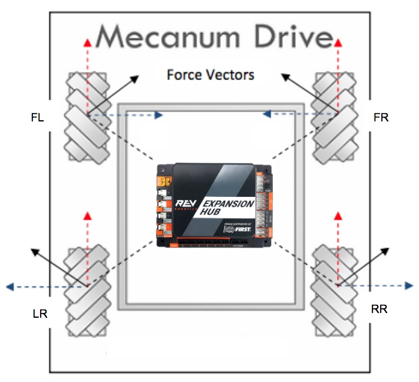

## Hood River Valley High School - SkyStone FTC Mecanum Base

This project is the Blocks and OnBotJava for a common Java platform for the HRVHS FTC teams using the
[TileRunner HD Mecanum](https://github.com/FIRST-Tech-Challenge/SkyStone) base.  The key things we wanted to accomplish are:
* Provide a common base for Blocks, On-Bot-Java, and Java development - so you have common, working, driver and autonomous
  functionality.
* Demonstrate (in Java) using a common Robot class that all the driver-controlled and autonomous OpModes can be built on so common
  functionality is on one place shared by all OpModes
* Demonstrate and give FTC programmers exposure (in Java) to the
  [command-based programming](https://wpilib.screenstepslive.com/s/currentCS/m/java/c/88893) paradigm used in the
  FRC WPILib platform.

### TileRunner Base Details

So lets define the HRVHS mecanum base in terms of the assembly and configuration. If we want to share and leverage common code,
we need a common robot base. So, this is a diagram of the mecanum base after assembly and mounting of the REV expansion hub for
the drive (a second REV expansion hub can be mounted anywhere):


The REV Expansion Hub should be mounted in the center of the chassis with the USB hub facing forward. Take care to align
the controller with the chassis so that a heading of 0 will be straight ahead.

Your motor configuration should be:
* 'FL' - (motor front left) power and encoder wired to REV port 0
* 'FR' - (motor front right) power and encoder wired to REV port 1
* 'RR' - (motor right rear) power and encoder wired to REV port 2
* 'LR' - (motor left rear) power and encoder wired to REV port 3

And the encoder should be configured as:
* 'IMU' - IC2 0 - port 0

### HRVHS Skystone Blocks

There are 3 Blocks files you can upload to your Blocks programming environment:

* **TestMotors** - Tests that motors and encoders are connected and configured correctly. When you run this program there
  are these driver controls:
  * dpad up - left front wheel should be getting power, should be turning forward, and the encoder value should be increasing.
  * dpad left - left rear wheel should be getting power, should be turning forward, and the encoder value should be increasing.
  * dpad right - right front wheel should be getting power, should be turning forward, and the encoder value should be increasing.
  * dpad down - right rear wheel should be getting power, should be turning forward, and the encoder value should be increasing.
  
  Troubleshooting:
  * If the program does not start and you get messages that `FL`, `FR`, `RR`, or `LR` could not be found, it means the motors
    have not been correctly configured in the configuration on your robot control phone. Ususally this meas a motor is missing
    or the name was misspelled.
  * If the wrong wheel spins - you have the motor that is spinning plugged into the wrong port.
  * If the encoder that is incrementing does not match the motor that is getting power and spinning - you don't have the encoder
    for the motor plugged into the same port as the motor.
    
  Don't try the other programs until you get this one to work correctly.
  
* **DriveExample** - An example of driver control using the IMU to maintain heading. It implements both *arcade* and *tank*
  drive, *arcade* is the default.
  
  For your drive modes, start with a copy of **DriveExample**
  
  In the runOpMode, you can disable *arcade_drive* and enable *tank_drive* if you want to
  use tank drive. When using *arcade* drive, the right stick controls forward-sideways and the heading of the robot will
  be maintained (using the IMU). If the left stick is used to turn the robot then the reference heading will be reset when
  the turn ends.
  
  These variables are in the initialization (prior to waitForStart):
  * **stick_deadband** - the range of stick motion assumed to have a value of 0.0. This is normally a very low value (like 0.05)
    and makes the stick read as 0 if you release it and it does not return exactly to 0, or you have a bit of unintentional
    pressure on the stick. You can set this to 0 to turn off deadband.
  * **stick_sensitivity** - controls sensitivity when the stick is near 0, so you have better fine control of the robot. The
    typical values range from 1.0 to 3.0, where 1.0 is turns off sensitivity correction, 2.0 is
    a sensitivity that drivers generally like and 3.0 is about the maximum sensitivity anyone likes.
  * **kp** - is a correction factor multiplied with the error between the current robot heading and the expected heading to
    add turn to maintain the expected heading. Set this to 0 to see what your robot would do without heading correction.
    Increase the value for more immediate heading correction. If your robot starts to rock side-to-side it means you have **kp**
    set too high.
    
* **AutoCalibrate** - is a driver controlled program to test and calibrate autonomous move/turn functions.

  For your autonomous modes, calibrate **AutoCalibrate** for your robot, then start with a copy of **AutoCalibrate** and:
  * change the opmode type from *TeleOp* to *Autonomous*
  * remove the driver control loop from runOpMode and replace this with your autonomous program.
  
  The autonomous move/turn methods are:
  * **move with inches, degrees** - move the specified distance (inches) in the specified direction (degrees) without
    changing the heading of the robot. A direct of 0&deg; is straight ahead; 90&deg; is to the right; -90&deg; is to the left.
    The distance may be negative.
  * **rotate with degrees** - turn the specified number of degrees, positive is clockwise.
  
  **Calibrating your robot**:
  
  Calibration requires asking the robot to make some well-defined movements, measuring what the robot did, and
  adjusting (calibrating) constants until the robot moves as requested. These driver controlled actions initiate
  well-defined autonomous movements (NOTE: the button press initiates the move - immediately release the button
  or you may be requesting the move be repeated multiple times):
  * dpad up - move forward *calibration_distance*.
  * dpad left - move left *calibration_distance*. If you have the left bumper pressed, turn counter-clockwise 90&deg;
  * dpad right - move right *calibration_distance*. If you have the left bumper pressed, turn clockwise 90&deg;
  * dpad down - move backwards *calibration_distance*.
  
  The default *calibration-distance* is 24" - which is one competition field floor tile. Ideally, you would pick the corner of
  a tile that you would return your robot to at the beginning of each calibration test. Each move/turn includes a ramp up to full
  speed, full speed movement, and a deceleration from full speed as the robot approaches the goal. Since the TileRunner base
  can be built with different gear ratios and the encoder is on the motor, not the wheel; each gear ratio will have its
  own calibrated constants. Additionally, differences in alignment, friction, motors, wheels, etc. mean that the calibration
  of no two robots is likely to be the same.
  
  Start by running *dpad up* and *dpad down*. Measure the distance forward the robot actually moves, when you move back, it
  should return to essentially the same place it started from. Since the TileRunner base can be built with different gear
  ratios the robot-specific calibration is just that, specific to to robot. Adjust the *tics_per_inch_forward* as:
  
  ```
  new_tics_per_inch_forward = (calibration-distance * tics_per_inch_forward) / measured_distance

  ```
  
  Now *dpad left* and *dpad right*. Measure the distance sideways the robot actually moves, when you move back, it
  should return to essentially the same place it started from. Since the TileRunner base can be built with different gear
  ratios the robot-specific calibration is just that, specific to to robot. Adjust the *tics_per_inch_sideways* as:
    
  ```
  new_tics_per_inch_sideways = (calibration-distance * tics_per_inch_sideways) / measured_distance
  
  ```
  
  Repeat this until you have consistent motion of the calibration distance as requested.
  
  **Calibration Constants**
  \
  These are the calibration constants that can be tuned to make your robot follow autonomous commands as
  accurately (and quickly) as possible:
  
  * **calibration_distance** - the calibration distance, defaults to 24".
  * **tics_per_inch_forward** - as discussed above. Forward tics are computed as the sum of the values of all
    encoders (which averages out wheel/motor-specific anomalies).
  * **tics_per_inch_sideways** - as discussed above. Sideways tics are computed as the sum of the sign-adjusted values
    of all encoders (which averages out wheel/motor-specific anomalies).
  * **mtr_accel_min** - the value of the ramp at start. Making this 1.0 removes the speed ramp up. The ramp up is to
    reduce slippage considerations. This should be as high as possible without creating slippage that makes encoder
    readings unreliable.
  * **mtr_decel_min** - the smallest value the power will ramp down to. In FRC we discovered that if this is 0, the robot
    can ve very close to, but not reaching the target, and the ramped value is so close to zero that the robot does not move,
    never reaches the target, and the move command loops forever. This prevents that situation. This should be as low
    as possible, but high enough that continued motion is assured.
  * **mtr_accel_ticks** - The number of encoder tics to accelerate from the **mtr_accel_min** to 1.0. If 0, the motors
    immediately accelerate to full power. Ideally, this is as low as possible without introducing slippage that makes
    **tics_per_inch_forward** or **tics_per_inch_sideways** unreliable.
  * **mtr_decel_tics**- The number of encoder tics to decelerate from 1.0 to **mtr_decel_min**. If 0, the motors
    immediately decelerate 0.0 once the target is reached. Ideally, this and **mtr_decel_min** are as low as possible without
    introducing overshoot or a situation where motion stops before the goal is reached.
  * **mtr_accel_degs** - analogous to **mtr_accel_ticks**, but in degrees for turn.
  * **mtr_decel_degs**- analogous to **mtr_decel_ticks**, but in degrees for turn.
  * **kp** - tunes speed of correction for heading deviations, see discussion in **DriveExample**

## HVRHS OnBotJava

Command-based programming in OnBotJava is relatively complex because it requires you load a programming framework of
code that is in your programming environment, but that you never change.

