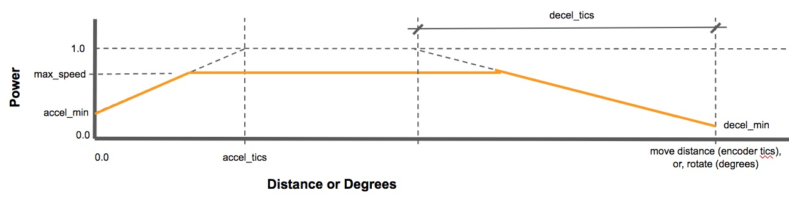

## Hood River Valley High School - SkyStone FTC Mecanum Base

This project is the Blocks and OnBotJava for a common platform for the HRVHS FTC teams using the
[TileRunner HD Mecanum](https://github.com/FIRST-Tech-Challenge/SkyStone) base.  The key things we wanted to accomplish are:
* Provide a common base for Blocks, On-Bot-Java, and Java development - so you have common working driver and autonomous
  functionality.
* Demonstrate (in Java) using a common Robot class that all the driver-controlled and autonomous OpModes can be built on so common
  functionality is on one place shared by all OpModes
* (Future) Demonstrate and give FTC programmers exposure (in Java) to the
  [command-based programming](https://wpilib.screenstepslive.com/s/currentCS/m/java/c/88893) paradigm used in the
  FRC WPILib platform.

## Revision Notes

* update 1 (30 Oct 2019):
  * Fixed telemetry for encoder values (they we previously all reporting the same encoder)
  * Improved initial calibration defaults based on testing with several TileRunner bases.
* update 2 (10 Dec 2019):
  * added `AutoCalibarate` companion functions fore `move(...)` and `rotate(...)` (which run at a max power of 1.0; i.e.
    the fastest the robot can go) as:
    * `moveAtSpeed(...)`, and `rotateAtSpeed(...)` - move or rotate respectively with the power limited to the specified maximum.
    * `parameterizedMove(...)`, and `ParameterisedRotate(...)` - move or rotate (respectively) with all aspects of the ramped
      power curve controlled by the passed in parameters.
  * Modified the IMU initialization to be before the wait for start, and to correctly terminate if stop is pressed on the
    driver control station for both `AutoCalibarate` and `DriveExample`. This fixes the problem of termination during
    initialization (done in the field inspection) hanging to robot and requiring a robot restart. Note that the old
    IMU initialization loop ran while `true`, it now runs while `opModeIsActive`.
  * Moved the IMU initialization before the `waitForStart`. The `expected_heading` is initialized after the `waitForStart`, so any
    IMU precession will be included in the `expected_heading`. Moving the initialization before the `waitForStart` means that
    the robot does not need to wait for IMU initialization at the beginning of the autonomous period.
* upodate 3 (7 Jan 2020)
  * Added the OnBotJava translation of the blocks code, with documentation in this README file.

### TileRunner Base Details

So, lets define the HRVHS mecanum base in terms of the assembly and configuration.
If we want to share and leverage common code,
we need a common robot base. So, this is a diagram of the mecanum base after assembly and mounting of the REV expansion hub for
the drive (a second REV expansion hub can be mounted anywhere):


***NOTE the wheel orientation/configuration of the wheel rollers should form an X. If they do not, then you will not
have sideways motion. This is the most common really serious construction error.***

The REV Expansion Hub should be mounted in the center of the chassis with the USB hub facing forward. Take care to align
the controller with the chassis so that a heading of 0 will be straight ahead (although, we do read the heading, and
use this as the reference 0 heading, when the
op mode starts; so there is a programmatic adjustment if the expansion hub is not perfectly aligned with the robot frame
and/or there has been a time delay that causes the imu gyros to [precess](https://en.wikipedia.org/wiki/Precession)
between initialization and start).

Your motor configuration should be:
* 'FL' - (motor front left) power and encoder wired to REV port 0
* 'FR' - (motor front right) power and encoder wired to REV port 1
* 'RR' - (motor right rear) power and encoder wired to REV port 2
* 'LR' - (motor left rear) power and encoder wired to REV port 3

And the encoder should be configured as:
* 'IMU' - IC2 0 - port 0

### HRVHS Skystone Blocks Programs

There are 3 Blocks program files you can upload to your Blocks programming environment:

* **TestMotors.blk** - Tests that motors and encoders are connected and configured correctly. When you run this program there
  are these driver controls:
  * dpad up - left front wheel should be getting power, should be turning forward, and the encoder value should be increasing.
  * dpad left - left rear wheel should be getting power, should be turning forward, and the encoder value should be increasing.
  * dpad right - right front wheel should be getting power, should be turning forward, and the encoder value should be increasing.
  * dpad down - right rear wheel should be getting power, should be turning forward, and the encoder value should be increasing.
  
  Troubleshooting:
  * If the program does not start and you get messages that `FL`, `FR`, `RR`, or `LR` could not be found, it means the motors
    have not been correctly configured in the configuration on your robot control phone. Usually this means a motor is missing
    in the configuration or the name was misspelled.
  * If the wrong wheel spins - you have the motor that is spinning plugged into the wrong port.
  * If the encoder that is incrementing does not match the motor that is getting power and spinning - you don't have the encoder
    for the motor plugged into the same port as the motor.
    
  ***Don't try the other programs until you get this one to work correctly.***
  
* **DriveExample.blk** - An example of driver control using the IMU to maintain heading. It implements both *arcade* and *tank*
  drive, *arcade* is the default.
  
  For your drive modes, start with a copy of **DriveExample**
  
  In the `runOpMode`, you can disable *arcade_drive* and enable *tank_drive* if you want to
  use tank drive. When using *arcade* drive, the right stick controls forward-sideways and the heading of the robot will
  be maintained (using the IMU). If the left stick is used to turn the robot then the reference heading will be reset when
  the turn ends.
  
  These variables are in the initialization (prior to waitForStart):
  * **stick_deadband** - the range of stick motion assumed to have a value of 0.0. This is normally a very low value (like 0.05)
    and makes the stick read as 0 if you release it and it does not return exactly to 0, or you have a bit of unintentional
    pressure on the stick. You can set this to 0 to turn off deadband.
  * **stick_sensitivity** - controls sensitivity when the stick is near 0, so you have better fine control of the robot. The
    typical values range from 1.0 to 3.0, where 1.0 is turns off sensitivity correction, 2.0 is
    a sensitivity that drivers generally like and 3.0 is about the maximum sensitivity anyone likes.
  * **kp** - is a correction factor multiplied with the error between the current robot heading and the expected heading to
    add turn to maintain the expected heading. Set this to 0 to see what your robot would do without heading correction.
    Increase the value for more immediate heading correction. If your robot starts to rock side-to-side it means you have **kp**
    set too high.
    
  **Troubleshooting**
  * Forward-backward and turn seem to work correctly, sideways does not work at all. ***PAY ATTENTION HERE!!!*** This probably
    means you have not correctly mounted you wheels (a common problem). Refer back to the figure at the beginning of this section
    and note that when you look down on the robot the orientation of the rollers on the mechanum wheels should trace an **X** over
    the chassis of the robot - if you get this wrong, you will not get the desired sideways motion.
    
* **AutoCalibrate.blk** - is a driver controlled program to test and calibrate autonomous move/turn functions.

  The autonomous move/turn methods are:
  * **move with inches, degrees** - move the specified distance (inches) in the specified direction (degrees) without
    changing the heading of the robot. A direct of 0&deg; is straight ahead; 90&deg; is to the right; -90&deg; is to the left.
    The distance may be negative.
  * **rotate with degrees** - turn the specified number of degrees, positive is clockwise.
  
  For your autonomous modes, calibrate **AutoCalibrate** for your robot (see notes below), then start with a copy
  of **AutoCalibrate** and:
  * change the opmode type from *TeleOp* to *Autonomous*
  * remove the driver control loop from runOpMode and replace this with your autonomous program. Your autonomous programs
    will probably use the **move with inches, degrees** and **rotate with degrees** to position the robot; and add methods to
    control lifters, grabbers, sensors, etc.
  
  **Calibrating your robot**:
  
  Calibration requires asking the robot to make some well-defined movements, measuring what the robot did, and
  adjusting (calibrating) constants until the robot moves as requested. These driver controlled actions initiate
  well-defined autonomous movements (NOTE: the button press initiates the move - immediately release the button
  or you may be requesting the move be repeated multiple times):
  * dpad up - move forward *calibration_distance*.
  * dpad left - move left *calibration_distance*. If you have the left bumper pressed, turn counter-clockwise 90&deg;
  * dpad right - move right *calibration_distance*. If you have the left bumper pressed, turn clockwise 90&deg;
  * dpad down - move backwards *calibration_distance*.
  
  The above moves/rotations will ramp up to full power by default. If the right bumper is pressed when the move/rotation is
  initiated it will only ramp up to half power.
  
  The default *calibration-distance* is 24" - which is one competition field floor tile. Ideally, you would pick the corner of
  a tile that you would return your robot to at the beginning of each calibration test. Each move/turn includes a ramp up to full
  speed, full speed movement, and a deceleration from full speed as the robot approaches the goal. Since the TileRunner base
  can be built with different gear ratios and the encoder is on the motor, not the wheel; each gear ratio will have its
  own calibrated constants. Additionally, differences in alignment, friction, motors, wheels, etc. mean that the calibration
  of no two robots is likely to be the same. WHAT THIS MEANS is run the calibration and set the constants for your robot
  so you can use a tape measure on the field to map out what you want your robot to do.
  
  Start by running *dpad up* and *dpad down*. Measure the distance forward the robot actually moves, when you move back, it
  should return to essentially the same place it started from. Since the TileRunner base can be built with different gear
  ratios the robot-specific calibration is just that, specific to your robot. Adjust the *tics_per_inch_forward* as:
  
  ```
  new_tics_per_inch_forward = (calibration-distance * tics_per_inch_forward) / measured_distance

  ```
  
  Now *dpad left* and *dpad right*. Measure the distance sideways the robot actually moves, when you move back, it
  should return to essentially the same place it started from. Since the TileRunner base can be built with different gear
  ratios the robot-specific calibration is just that, specific to to robot. Adjust the *tics_per_inch_sideways* as:
    
  ```
  new_tics_per_inch_sideways = (calibration-distance * tics_per_inch_sideways) / measured_distance
  
  ```
  
  Repeat this until you have consistent motion of the calibration distance as requested.
  
  **Ramped Motion**
  
  Ramped motion means starting at some acceleration minimum power, ramping to the maximum power, running at maximum power
  until you get close to the target, and then decelerating to some deceleration minimum power so you minimally overshoot the
  target. By default, calibration ramps to maximum speed of 1.0 then decelerates, see the diagram below:
  
  
  
  NOTE: when you are calibrating (see notes below on **Calibration Constants**), you are calibrating without outside forces
  on your robot. In competition, there may be outside forces (i.e. you are hitting/dragging the foundation, your are hitting
  the outer wall to align yourself, you are carrying/drgging blocks, etc.). In these cases, the
  default minimum `accel` or `decel` power may not be sufficient. Use
  the `parameterisedMove(...)` or `parameterisedRotate(...)` if you need to override the default calibration values for a
  specific action.
  
  **Calibration Constants**
  
  These are the calibration constants that can be tuned to make your robot follow autonomous commands as
  accurately (and quickly) as possible:
  
  * **calibration_distance** - the calibration distance, defaults to 24".
  * **tics_per_inch_forward** - as discussed above. Forward tics are computed as the sum of the values of all
    encoders (which averages out wheel/motor-specific anomalies).
  * **tics_per_inch_sideways** - as discussed above. Sideways tics are computed as the sum of the sign-adjusted values
    of all encoders (which averages out wheel/motor-specific anomalies).
  * **mtr_accel_min** - the value of the ramp at start. Making this 1.0 removes the speed ramp up. The ramp up is to
    reduce slippage considerations. This should be as high as possible without creating slippage that makes encoder
    readings unreliable.
  * **mtr_decel_min** - the smallest value the power will ramp down to. In FRC we discovered that if this is 0, the robot
    can be very close to, but not reaching the target, and the ramped value is so close to zero that the robot does not
    move (i.e., it never reaches the target, and there is not enough power to overcome friction and move the robot).
    The result is that the move command loops forever (locking the program in a move that never completes). A correct value
    here prevents that situation. This should be as low as possible, but high enough that continued motion towards the goal
    is assured.
  * **mtr_accel_ticks** - The number of encoder tics to accelerate from the **mtr_accel_min** to 1.0. If 0, the motors
    immediately accelerate to full power. Ideally, this is as low as possible without introducing slippage that makes
    **tics_per_inch_forward** or **tics_per_inch_sideways** unreliable.
  * **mtr_decel_tics** -  The number of encoder tics to decelerate from 1.0 to **mtr_decel_min**. If 0, the motors
    immediately decelerate 0.0 once the target is reached. Ideally, this and **mtr_decel_min** are as low as possible without
    introducing overshoot or a situation where motion stops before the goal is reached.
  * **mtr_accel_degs** - analogous to **mtr_accel_ticks**, but in degrees for turn.
  * **mtr_decel_degs** - analogous to **mtr_decel_ticks**, but in degrees for turn.
  * **kp** - tunes speed of correction for heading deviations, see discussion in **DriveExample**
  
  **Troubleshooting**
  * You make a request (move, turn) and it never completes (the drive mode seems to hang, and you can't do anything other than
    forcing a restart). This probably means your **mtr_decel_min** is too low. Specifically, your robot is almost the the 
    target position, but, the power is so low that it will not move the robot that last inch. Solution: increase
    **mtr_decel_min** and/or decrease **mtr_decel_tics**.

## HVRHS OnBotJava Programming

There are a couple possible steps in moving to Java, and then command-based programming. The first step is translating the
blocks base programs to Java, and then refining that so there is a common base that you extend for all of your drive and
autonomous programs. We did that with the three blocks programs and added an `OBJ` prefix (for **O**n**B**ot**J**ava) to
the name.

In your blocks programming environment switch to OnBotJava and upload all of the files in the OnBotJava folder. Then hit the
build icon to build all of the files an install them on your robot control phone. You can then run these programs and the should
run the same as the blocks counterpart:

* **OBJMotorTest** see MotorTest notes in the Blocks programming section.
* **OBJDriveExample** see DriveExample notes in the Blocks programming section.
* **OBJAutoCalibrate** see AutoCalibrate notes in the Blocks programming section.
* **OBJAutoExample** A simple example autonomous program that moves the robot in a diamond pattern and then spins it
  once clockwise and once counterclockwise. Copy this as a starting point for your autonomous program.
  
### Differences Between Blocks and OnBotJava Programming

The big difference is that a Blocks program is a complete program in one file, while Java allows the program to be
broken into smaller classes/files that can be shared between programs. Java also allows a thing called inheritance, which lets us
put common functionality in a single class/file. We see this in the class structure of the OnBotJava code:

* `AMecBase.java` - This is an abstract class extending the FTC framework `LinearOpMode` to add the 'constants', motor
  initialization and setup, autonomous move functions, drive support functions (not connected to input).
* `AMyMecBase.java` - This is an abstract class extending `AMecBase` to add the specifics for your robot. These specifics
  include resetting 'constants' for the specifics of your base (different gear ratios, friction, balance and other
  constructions differences), as well as the common game control functions like `grabFoundation()`, `releaseFoundation()`, and
  `senseSkystone()`. There are a couple software design questions commonly asked:
  * *Why don't I add my robot code to `AMecBase` instead of adding another base class?* - Because `AMecBase` supports the common
    mecanum base, and if teams request or contribute new or refined capabilities you may want to replace your copy of
    `AMecBase.java` with a new one, and you don't want this to interfere with the code for your robot. So you want to
    overlay your robot code on top of `AMecBase.java`, not integrate it into `AMecBase.java`.
  * *What stuff really goes in `AMyMecBase`?* - when you are writing your OpModes, you will write code to do some game
    operation in an OpMode.  Later you will be writing another op mode and your will realize you need the same game code in
    that OpMode. You will be tempted to copy the code from the first OpMode - don't - move that code into a function in
    `AMyMecBase` that both OpModes call. That way, if you need to fix the game operation, you do it on one place, and
    it applies to all the OpModes. Don't duplicate code.
* `OBJMotorTest`, `OBJDriveExample`, `OBJAutoCalibrate`, and `OBJAutoExample` extend `AMecBase` and basically connect gamepad
  actions to functions in `AMecBase`. When you build your teleop and autonomous OpModes you will be copying these basic
  programs which only control the mecanum base, and adding calls to the functions you added to `AMyMecBase` to perform the
  game-specific actions.

## HRVS Command-Based Programming

Command-based programming in OnBotJava is relatively complex because it requires you load a programming framework of
code into your programming environment, but that you never change.

